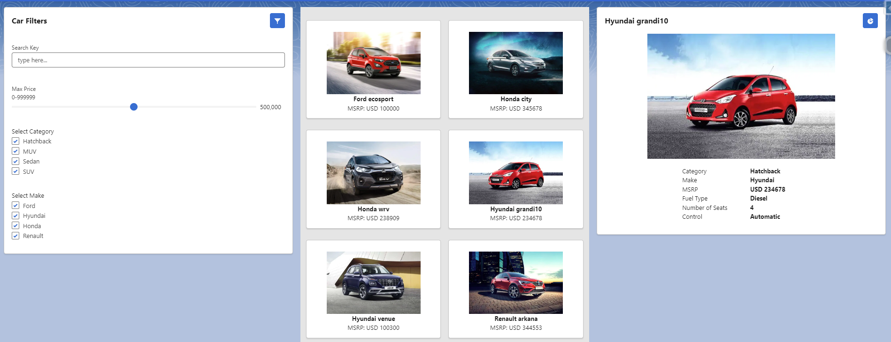
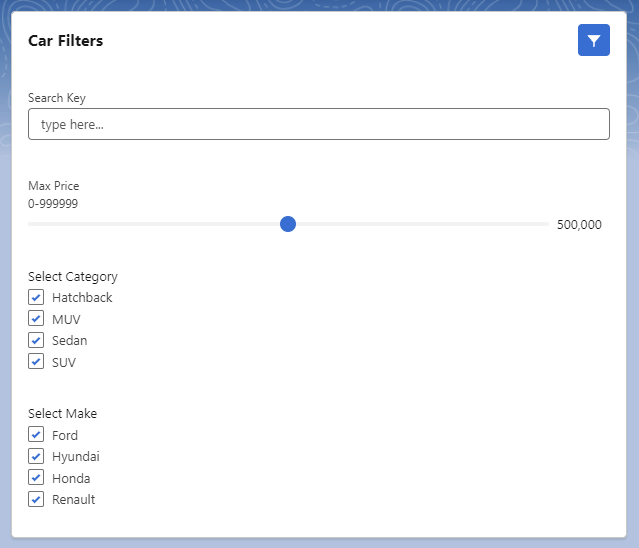
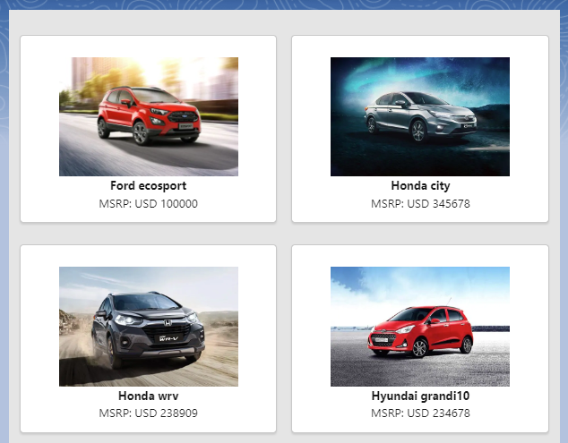
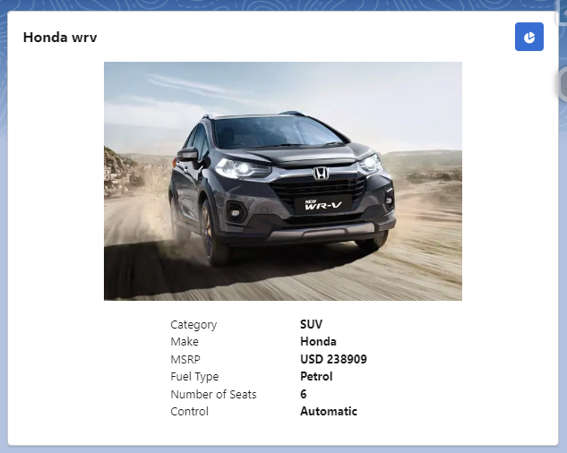

# Car Hub Project

## Overview

**Explore and view cars**

Filter Cars by 
* Name
* Price
* Category
* Make

## LWC Setup

This project consists of 3 components

### Component one: Filters

1. Search Key
Search by the name of the car. All cars containing the entered search key as part of the car name will be returned

2. Max Price
Exactly that.
   Filter any cars below that price point

3. Category
Shows cars that meet any of the selected categories. Click any car to view more details about cars and see the category

4. Make
Filters by Make similar to Category filter

### Component two: Car Tiles

Shows the results from the filters in the first component, duh.

These cars are clickable, upon click a detailed view of the car shows up in component 3.

### Component three: Car Details

A more details view of the selected car that shows the following info

* Name
* Category
* Make
* MSRP (Price)
* Fuel Type
* Number of Seats
* Control

## Database Setup

**Custom Object: Car**

### Fields

| Field Label     | Data Type      |
|-----------------|----------------|
| Car name        | Text           |
| Category        | Picklist       |
| Control         | Picklist       |
| Description     | Long Text Area |
| Fuel Type       | Text           |
| Make            | Picklist       |
| MSRP            | Currency       |
| Number of Seats | Number         |
| Picture URL     | URL            |

### Picklist Values

| Category  | Control   | Make    | 
|-----------|-----------|---------| 
| Hatchback | Automatic | Ford    | 
| MUV       | Manual    | Hyundai | 
| Sedan     |           | Honda   | 
| SUV       |           | Renault | 

This project is part of Salesforce Troop Udemy course, I designed and built this with the knowledge I learned and the approach and the solution are different than the solution in the course. 

